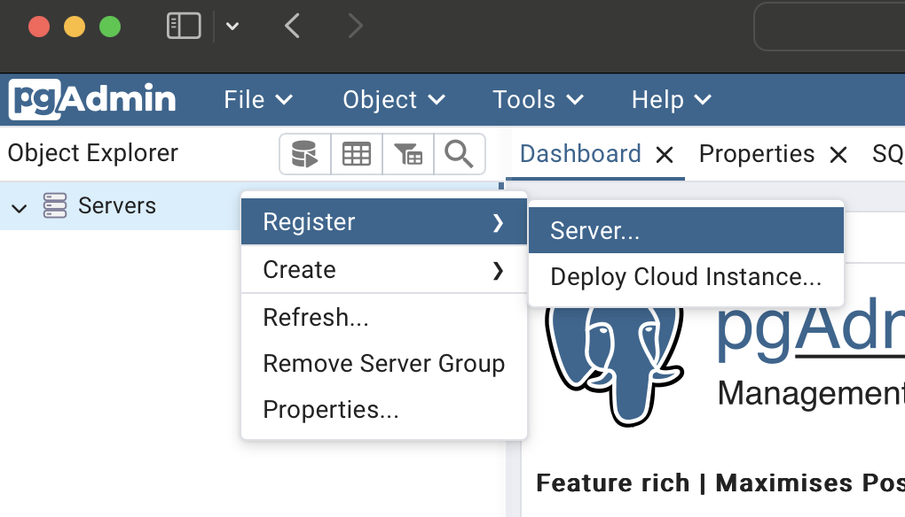
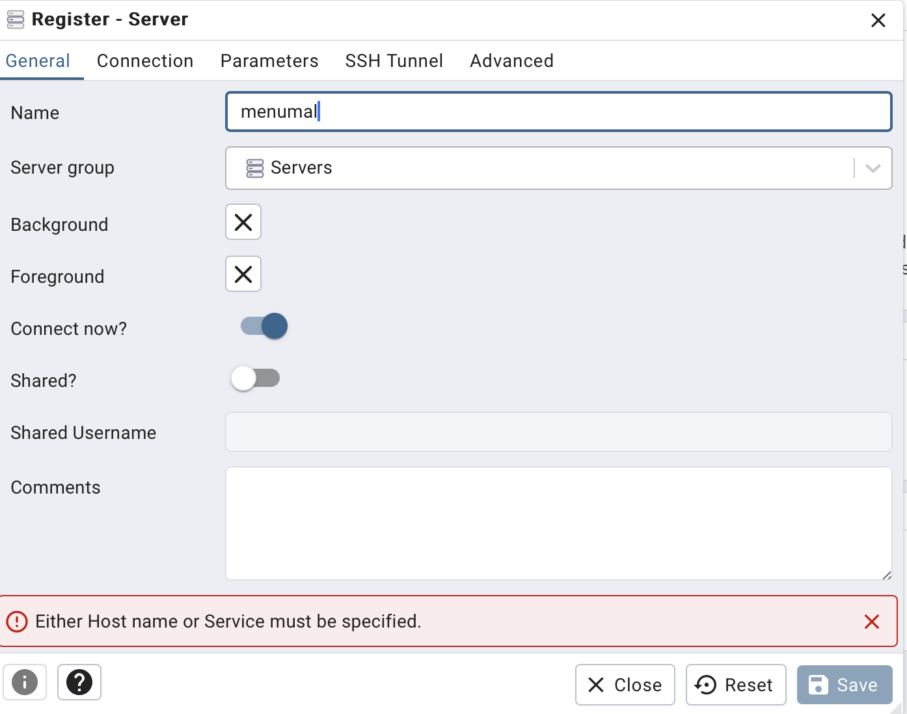
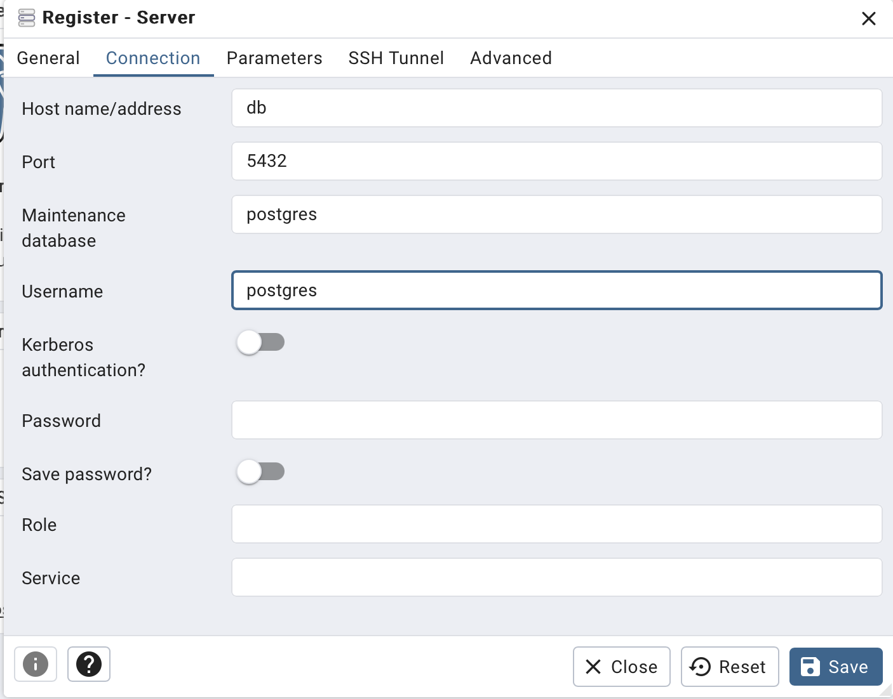

## Installation

```bash
$ npm install
```

## Running the app

```bash
# development
$ npm run start

# watch mode
$ npm run start:dev

# production mode
$ npm run start:prod
```

## Test

```bash
# unit tests
$ npm run test

# e2e tests
$ npm run test:e2e

# test coverage
$ npm run test:cov
```

While writing a test file:

```bash
npm run test:watch
```

Press `p` to filter by a filename regex pattern, put the file name and press `Enter` to run the tests in that file.

class-validator: https://github.com/typestack/class-validator
remove <none> images dangling : sudo docker image prune

## Swagger

### CLI Plugin

No need to use decorators to document the api. The swagger plugin will generate the documentation, types and validation automatically. Only enums need to be defined for the plugin to work. Also is good to provide a example for each property.
What should be done is to specify the not success responses for each endpoint.

## Endpoints

The api documentation is available at the following url:

```
http://localhost:3000/api

```

You can download the json or yaml documentation at the following url:

```

http://localhost:3000/api-json
http://localhost:3000/api-yaml

```

### CRUD generator

To scaffold a new module for CRUD operations use this command:

```bash
nest g resource resource_name
```

## Dev Container

Set the directory as safe in git to avoid permission issues (outside the container):

```bash
git config --global --add safe.directory /workspace
```

### Initialize the database

If first time running the dev container, or you removed the postgres container volume, run the following commands (inside the shell after opening the dev container) to initialize the database schema and seed the database (the data will be retained in a volume so it will persist between container restarts):

```bash
npx drizzle-kit migrate
npm run cli -- seeding --seed_path './src/database/seeding/users_seed.json'
```

### PgAdmin

Open in browser PGAdmin

```bash
xdg-open http://localhost:8888
```

if first time opening or deleted the volume:

1. Create a server



2. Add name



3. Modify hostname to db and username to postgres



### Drizzle studio

Drizzle studio is automatically started when the dev container is started. Open in browser Drizzle studio

```bash
xdg-open https://local.drizzle.studio?port=3003
```

docker ps
docker exec -it <container_id_or_name> /bin/bash

## License

Nest is [MIT licensed](LICENSE).

nest start cli
